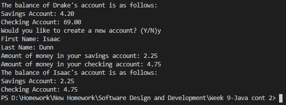

# Overview

This is a simple banking program designed to display a proficiency with classes and object-oriented programming. It creates a list of 3 accounts and allows the user to display one. It then allows the user to create one and displays it back to them.

# Development Environment

* Java
* Visual Studio Code

# Execution

To run: `java Main.java`   
<b>A working example:</b> 

# Useful Websites

1. [Java Reference](https://web.fe.up.pt/~aaguiar/teaching/pc/Java-QuickReferenceGuide.pdf)
2. [W3Schools Java Tutorial](https://www.w3schools.com/java/)